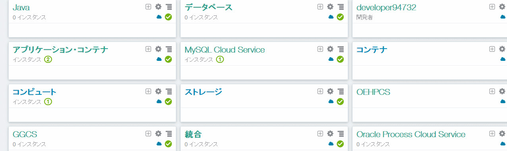

# RESTful Web Service connected to MySQL Sample on Oracle Application Container Cloud Service


This is a sample application on Oracle Application Container Cloud Service that RESTful Web Service connects to MySQL.

## Description
This application is composed with Jersey as JAX-RS and Hibernate as JPA. And Oracle MySQL Cloud Serivce is used as MySQL Server.

Application logic is very simple. When it accepts the GET request, it shows data stored in MySQL.

## Demo


## Features

There are the folowing sub resources:
- /all
  - Show all data
- {id}
  - Find data with the id

## Requirement

This applcication have the following dependencies:
- jersey-container-grizzly2-http
  - version: 2.26-b02
- jersey-media-json-jackson
  - version: 2.26-b02
- hibernate-core
  - version: 5.2.9.Final
- hibernate-validator
  - version: 5.4.1.Final
- hibernate-java8
  - version: 25.2.9.Final
- mysql-connector-java
  - version: 26.0.6

## Usage

- Show all data (/all)
  - GET http(s)://<DOMAIN>:<PORT>/myapp/pokemon/[1-802]
- Find data with the id ({id})
  - GET http(s)://<DOMAIN>:<PORT>/myapp/pokemon/all

## Installation

This application load Environmental information concerning Servr and Database from **Environmental Variables**

The following information is defined as Environmental Variables:
- Host name (as HOSTNAME)
- Port number (as PORT)
- MySQL Connect String (as MYSQLCS_CONNECT_STRING)
  - MySQL Server address and Port number
- MySQL User name (as MYSQLCS_USER_NAME)
- MySQL User Password (as MYSQLCS_USER_PASSWORD)

In ther source code they are difined like the following:

- Server ()

```java
static{
    PROTOCOL = "http://";
    HOST = Optional.ofNullable(System.getenv("HOSTNAME"));
    PORT = Optional.ofNullable(System.getenv("PORT"));
    PATH = "myapp";
    BASE_URI = PROTOCOL
            + HOST.orElseGet(() -> "localhost")
            + ":"
            + PORT.orElseGet(() -> "8080")
            + "/"
            + PATH
            + "/";
}
```

- MySQL

```java
static {
    JDBC_DRIVER = "com.mysql.cj.jdbc.Driver";
    JDBC_URL = "jdbc:mysql://" + System.getenv("MYSQLCS_CONNECT_STRING");
    JDBC_USER = System.getenv("MYSQLCS_USER_NAME");
    JDBC_PASSWORD = System.getenv("MYSQLCS_USER_PASSWORD");
    if (JDBC_USER == null) {
        JDBC_ENV_FLG = false;
    } else {
        JDBC_ENV_FLG = true;
    }
}
```
## Licence

Released under the [MIT license](https://gist.githubusercontent.com/shinyay/56e54ee4c0e22db8211e05e70a63247e/raw/44f0f4de510b4f2b918fad3c91e0845104092bff/LICENSE)

## Author

[shinyay](https://github.com/shinyay)
